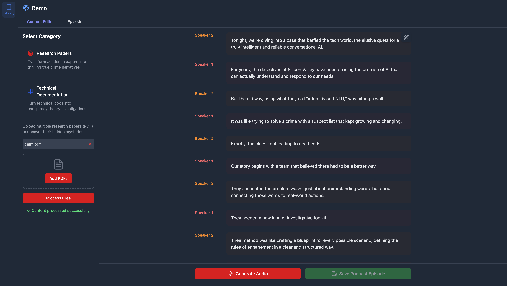

# Narrative Podcast Generator 🎙️🤖

Transform dry research papers and technical documentation into captivating podcast narratives with AI-powered storytelling!



## 🌟 Key Features

### Dual Content Transformation
- **Research Papers Mode**: 
  - Convert academic PDFs into thrilling true crime-style narratives
  - Turn research questions into mysterious investigations
  - Frame methodologies as detective work
  - Present findings as dramatic revelations

- **Technical Documentation Mode**:
  - Transform technical docs into conspiracy theory-style exposés
  - Present technical concepts as "hidden knowledge"
  - Create intriguing connections between technical details
  - Uncover "secrets they don't want you to know"

### Advanced AI-Powered Capabilities
- 🧠 Content Processing with Google Gemini
- 🎭 Two-Speaker Dramatic Script Generation
- 🎨 Dynamic Styling and Tone Preservation
- 🔊 Multilingual Text-to-Speech with OpenAI
- ✏️ Real-time Transcript Editing
- 🔧 Intelligent Transcript Refinement

## 🚀 How It Works

### 1. Choose Your Narrative Style
- **Research Papers**: Transform academic content into true crime podcasts
- **Technical Docs**: Turn documentation into conspiracy narrative podcasts

### 2. Input Your Content
- Upload multiple PDFs for research papers
- Add URLs for technical documentation
- Supports batch processing of multiple documents

### 3. AI-Powered Transformation
- Gemini AI analyzes and synthesizes content
- Generates a captivating two-speaker script
- Preserves key information with dramatic flair

### 4. Refinement and Customization
- Edit transcript in real-time
- Use the "Refine" feature to:
  - Adjust dramatic intensity
  - Add more technical details
  - Modify tone and style
  - Enhance storytelling elements

### 5. Generate Podcast
- Create audio with distinct voices for each speaker
- Uses OpenAI's Text-to-Speech technology
- Supports multiple voice profiles
- Instant audio generation and playback

## 🛠 Technologies

### Frontend
- HTMX for dynamic interactions
- Tailwind CSS for responsive design
- Lucide Icons
- Vanilla JavaScript
- Dark/Light mode support

### Backend
- FastAPI
- Google Gemini API
- OpenAI TTS API
- PyPDF2
- Beautiful Soup for web scraping

## 🔧 Prerequisites
- Python 3.8+
- Google Gemini API key
- OpenAI API key

## 🚀 Quick Start

### Installation
```bash
# Clone the repository
git clone https://github.com/souvikg10/mystery-podcast-gen
cd mystery-podcast-gen

# Create virtual environment
uv venv
source .venv/bin/activate  # Unix/macOS
# OR venv\Scripts\activate  # Windows

# Install dependencies
uv pip install -r requirements.txt


### Running the Application
```bash
# Start the FastAPI server
uvicorn app.main:app --reload --port 8000
```

### Configuration
1. Access the web interface at `http://localhost:8000`
2. Create account at your supabase
3. Login to the app
4. Select your content type (Research or Technical)
5. Upload documents or paste URLs
6. Generate and refine your podcast narrative


## 🤝 Contributing
Contributions, issues, and feature requests are welcome!


## 🚨 Disclaimer
- AI-generated content may contain inaccuracies
- Always verify critical information
- Intended for creative and entertainment purposes
